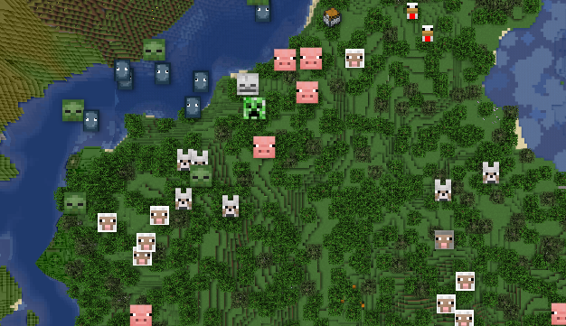

# BlueMapMobs

Adds markers for mobs (and also vehicles) on your [BlueMap](https://github.com/BlueMap-Minecraft/BlueMap) maps.

## Compatibility

Compatibility between versions is very hard with this plugin as new mobs are often added to the game as well as some breaking internal changes.

The plugin *may* work with Minecraft version released after a given release, but new mobs and vehicles (if any) won't show properly.

Installing the plugin with an older version however will most likely result in an error. Please refer to the following table to find what version you should use for your server :

| Server version  | Plugin version |
|-----------------|----------------|
| 1.20.4 - 1.20.5 | 1.0.0          |
| 1.20.6          | 1.1.0          |
| 1.21.0 - 1.21.3 | 1.2.0          |
| 1.21.4          | 1.3.0          |
| 1.21.5          | 1.4.0 - 1.4.2  |
| 1.21.6          | 1.5.0 - 1.5.1  |

## Configuration

The plugin provides a few configuration options to customize the markers, or the web assets.
All configuration values are in the standard `config.yml`.
The plugin is reloaded normally when BlueMap is reloaded.

## Download

The plugin `.jar` can be downloaded via the [Releases](https://github.com/Renaud11232/BlueMapMobs/releases) page.

## Need help ?

If you need help / encounter an bug, please [open an issue](https://github.com/Renaud11232/BlueMapMobs/issues/new).