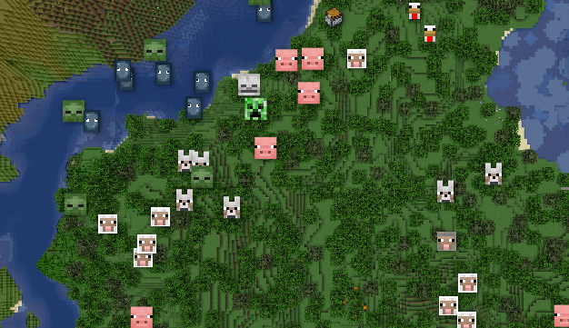

# BlueMapEntities

BlueMapEntities is a set of plugins that adds markers for various entities on
your [BlueMap](https://github.com/BlueMap-Minecraft/BlueMap) maps.

## Compatibility

Compatibility between versions is very hard as new entities are often added to the game as well as some breaking
internal changes.

The plugins *may* work with Minecraft version released after a given release, but new entities (if any) won't show
properly.

Using an older version of Minecraft however will most likely result in an error. Please refer to the following table to
find what version you should use for your server :

| Server version   | Plugin version              |
|------------------|-----------------------------|
| 1.20.4 - 1.20.5  | 1.0.0 (BlueMapMobs)         |
| 1.20.6           | 1.1.0 (BlueMapMobs)         |
| 1.21.0 - 1.21.3  | 1.2.0 (BlueMapMobs)         |
| 1.21.4           | 1.3.0 (BlueMapMobs)         |
| 1.21.5           | 1.4.0 - 1.4.2 (BlueMapMobs) |
| 1.21.6 - 1.21.8  | 1.5.0 - 1.5.1 (BlueMapMobs) |
| 1.21.9 - 1.21.10 | 1.6.0 (BlueMapMobs)         |
| 1.21.11          | 1.7.0 (BlueMapMobs)         |
| 26.1 - 26.1.2    | 2.0.0                       |
| 26.2             | 2.1.0 - 2.1.1               |

Starting with version `2.1.0`, BlueMapMobs was split into separate plugins for mobs, vehicles, NPCs and other entities.

## Configuration

These plugins provide a few configuration options to customize the markers. All configuration values are in the standard
`config.yml` for Bukkit base servers and a `config.json` file for Fabric. The plugin is reloaded normally when BlueMap
is reloaded.

## Download

The `.jar` files can be downloaded via the [Releases](https://github.com/Renaud11232/BlueMapMobs/releases) page. You
will need to choose the correct version depending on your server software :

* Files ending with `-bukkit` should work with all Bukkit-based servers (Paper, Spigot, Purpur, ...)
* Files ending with `-paper` will only work on PaperMC (and forks)
* Files ending with `-spigot` will only work on Spigot (and forks)
* Files ending with `-fabric` will only work on Fabric servers

## Need help ?

If you need help / encounter an bug, please [open an issue](https://github.com/Renaud11232/BlueMapMobs/issues/new).